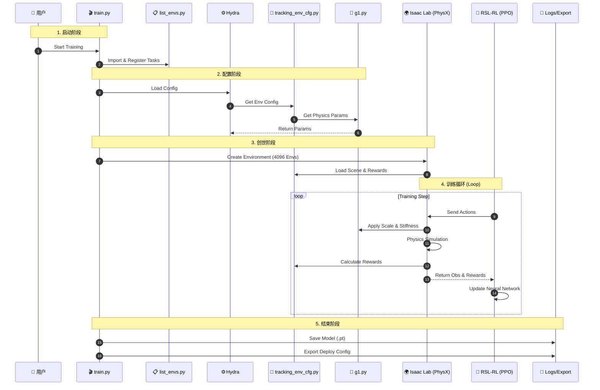

# G1 觉醒：模仿游戏 —— Unitree RL Lab 训练全流程深度解析

## 🎬 序幕：项目概览与角色表

这是一部关于“如何教会机器人跳舞”的硬核科幻纪录片。在这个项目中，代码不仅仅是指令，它们是导演、编剧、特技指导和裁判。

### 🎭 演职员表 (核心文件与模块)

| 角色代号 | 文件路径 | 职位 | 核心职责 |
| :--- | :--- | :--- | :--- |
| **总导演** | `scripts/rsl_rl/train.py` | 执行制片 | 统筹全局，解析指令，启动仿真，连接大脑与身体。 |
| **选角导演** | `scripts/list_envs.py` | 资源管理 | 扫描并注册所有可用的任务环境 (Task ID)。 |
| **编剧** | `.../tracking_env_cfg.py` | 世界观设定 | 定义仿真环境的物理规则、奖励机制、观测空间。 |
| **特技指导** | `.../g1.py` | 动作设计 | 定义机器人的物理参数 (刚度、阻尼) 和动作映射 (Action Scale)。 |
| **道具师** | `.../assets/robots/unitree.py` | 资产管理 | 提供机器人的 3D 模型 (USD) 和 URDF 描述。 |
| **舞蹈编导** | `*.npz` (如 `G1_gangnam_style...`) | 动作指导 | 提供标准参考动作数据 (Reference Motion)。 |
| **片场总管** | `isaaclab.envs.ManagerBasedRLEnv` | 现场执行 | 在 Isaac Sim 中实例化场景，管理重置、步进。 |
| **裁判团** | `RewardManager` (in IsaacLab) | 绩效考核 | 根据动作相似度计算奖励 (Reward)。 |
| **大脑** | `RSL-RL (PPO)` | 学习主体 | 强化学习算法，负责根据奖励优化策略网络。 |
| **物理引擎** | `PhysX (Omniverse)` | 自然法则 | 计算碰撞、摩擦、重力、动力学。 |

---

## 🎥 第一幕：启动与集结 (The Bootloader)

**场景**：Linux 终端 (Terminal)
**动作**：用户输入 `python scripts/rsl_rl/train.py --task Unitree-G1-29dof-Mimic-Gangnanm-Style --headless`

### 1.1 选角与注册 (Registration)
*   **剧情**：`train.py` 启动后的第一件事，就是呼叫 `list_envs.py`。
*   **细节**：
    *   `list_envs.import_packages()` 像雷达一样扫描 `source/unitree_rl_lab/tasks` 目录。
    *   它递归地导入每一个子包，触发其中的 `__init__.py`。
    *   **关键时刻**：`gangnanm_style/__init__.py` 执行 `gym.register(...)`，向 Gym 注册表提交了 ID `Unitree-G1-29dof-Mimic-Gangnanm-Style`，并绑定了入口类 `ManagerBasedRLEnv` 和配置入口 `tracking_env_cfg:RobotEnvCfg`。

### 1.2 法律与合同 (Argument Parsing)
*   **剧情**：`cli_args.py` 进场，审核用户意图。
*   **细节**：
    *   它解析 `--headless`（不渲染画面，专注计算）、`--video`（是否录像）。
    *   它还会注入 RSL-RL 的默认参数（如 `num_envs` 默认为 4096，`device` 默认为 CUDA）。

### 1.3 场地租赁 (App Launch)
*   **剧情**：`AppLauncher` 拨通了 NVIDIA Omniverse 的热线。
*   **特效**：
    *   后台启动 `kit.exe` (Omniverse Kit)。
    *   加载 `PhysX` 物理引擎插件。
    *   加载 `USD` 场景描述插件。
    *   如果是 Headless 模式，它会关闭图形渲染管线以节省显存。

---

## 🎥 第二幕：蓝图与构建 (Configuration & Genesis)

**场景**：内存与显存 (RAM & VRAM)

### 2.1 剧本研读 (Hydra Configuration)
*   **剧情**：`@hydra_task_config` 装饰器拦截了 `main` 函数。
*   **细节**：
    *   它根据 Task ID 找到对应的 `tracking_env_cfg.py`。
    *   **环境编剧 (`RobotEnvCfg`)** 开始工作：
        *   **Scene**: 设定时间步长 `dt=0.005s`，重力 `-9.81`。
        *   **Robot**: 呼叫 `unitree.py` 获取 USD 路径，呼叫 `g1.py` 获取关节参数。
        *   **Observations**: 决定神经网络能“看”到什么（关节位置、速度、相位）。
        *   **Actions**: 决定神经网络能“动”什么（29个关节的目标位置）。
        *   **Rewards**: 设定评分标准（模仿得像给分，摔倒扣分）。

### 2.2 道具组装 (Asset Loading)
*   **剧情**：`g1.py` 和 `unitree.py` 协同工作。
*   **特写**：
    *   `unitree.py` 指向 `/assets/robots/g1_description/.../g1.usd`。
    *   `g1.py` 定义了 **Actuator Network**：
        *   `stiffness` (Kp) = 20.0
        *   `damping` (Kd) = 0.5
        *   `armature` (电枢惯量) = 0.01
        *   **关键公式**：`action_scale = 0.25 * effort_limit / stiffness`。这决定了神经网络输出的 `1.0` 对应物理世界中多大的力矩或位置偏移。

### 2.3 创世 (Environment Instantiation)
*   **剧情**：`gym.make()` 调用 `ManagerBasedRLEnv`。
*   **大场面**：
    *   在 Isaac Sim 的 Stage 上，瞬间克隆出 **4096 个 G1 机器人**。
    *   每个机器人被分配到一个独立的物理岛屿（Env），互不干扰。
    *   **舞蹈编导** (`.npz` 文件) 被加载到内存，准备好随时提供标准动作数据。

---

## 🎥 第三幕：无限循环 (The Training Loop)

**场景**：GPU CUDA Cores
**剧情**：这是电影的高潮，一个每秒发生 30-60 次的高频循环。

### 3.1 感知 (Sense - ObservationManager)
*   **动作**：摄影师抓拍 4096 个机器人的状态。
*   **数据流**：
    *   读取 PhysX 里的关节角度 (Joint Pos) 和速度 (Joint Vel)。
    *   读取当前的舞蹈相位 (Phase, 0~1 之间，表示动作进行到哪了)。
    *   打包成张量 `obs_buf` (Shape: `[4096, obs_dim]`)。

### 3.2 思考 (Think - RSL-RL PPO)
*   **动作**：大脑 (Actor Network) 接收 `obs_buf`。
*   **计算**：
    *   经过 3 层 MLP (多层感知机) 的矩阵乘法。
    *   输出 `actions` (Shape: `[4096, 29]`)。
    *   同时，Critic Network 估计当前状态的价值 (Value)，用于后续评估。

### 3.3 执行 (Act - PhysX & g1.py)
*   **动作**：特技指导拦截 `actions` 并转化为物理指令。
*   **转换**：
    *   `target_pos = actions * action_scale + default_dof_pos`
    *   `torque = stiffness * (target_pos - current_pos) - damping * current_vel`
*   **物理计算**：
    *   PhysX 求解器计算力矩对刚体的影响。
    *   处理碰撞（脚与地面）、摩擦力。
    *   更新下一帧的机器人位置和速度。

### 3.4 评价 (Critique - RewardManager)
*   **动作**：裁判团根据物理结果打分。
*   **评分细则**：
    *   **Joint Pos Reward**: `exp(-|target_joint - current_joint| / sigma)`。动作越像，分越高。
    *   **End Effector Reward**: 手脚位置对上了吗？
    *   **Penalty**: 身体是不是抖得太厉害？有没有摔倒？
*   **结果**：生成 `rew_buf` (奖励) 和 `reset_buf` (是否需要重置)。

### 3.5 学习 (Learn - OnPolicyRunner)
*   **动作**：每收集 24 步 (或其他 horizon 长度) 数据，进行一次反向传播。
*   **核心**：
    *   计算 **Advantage** (实际得分比预期好多少？)。
    *   **PPO Loss**: 调整网络权重，增加高分动作的概率，减少低分动作的概率。
    *   **Logging**: 将平均奖励、损失值写入 Tensorboard 日志。

---

## 🎥 尾声：杀青与发行 (Post-production)

**场景**：硬盘存储 (`logs/` 目录)

### 4.1 封存 (Checkpointing)
*   **剧情**：每隔一定步数，保存 `model_*.pt`。这是训练出的“大脑”切片。

### 4.2 导出 (Export Deploy Config)
*   **剧情**：`export_deploy_cfg.py` 进场。
*   **细节**：
    *   它把训练时用到的 `action_scale`, `stiffness`, `damping`, `default_dof_pos` 等关键参数提取出来。
    *   保存为 `config.yaml` 或类似格式。
    *   **意义**：这是为了让 C++ 部署代码 (`deploy/`) 能够复刻 Python 训练时的物理参数，确保“所学即所用”，防止 Sim2Real Gap（仿真与真机差距）。

### 4.3 影评 (Tensorboard)
*   **剧情**：用户打开 Tensorboard 查看 `Reward` 曲线。
*   **结局**：
    *   **Happy Ending**: 曲线稳步上升，机器人学会了跳舞。
    *   **Bad Ending**: 曲线震荡或归零，机器人躺平了（需要调参）。

---

## 📊 附录：全景协同图谱 (Mermaid)

